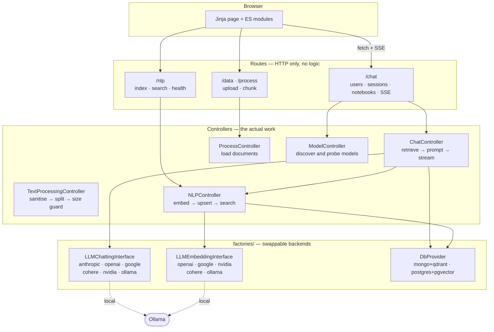
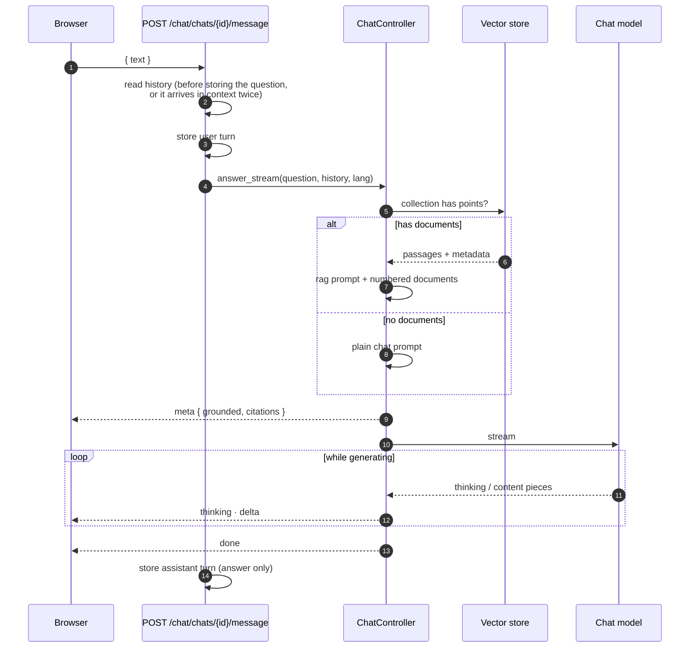
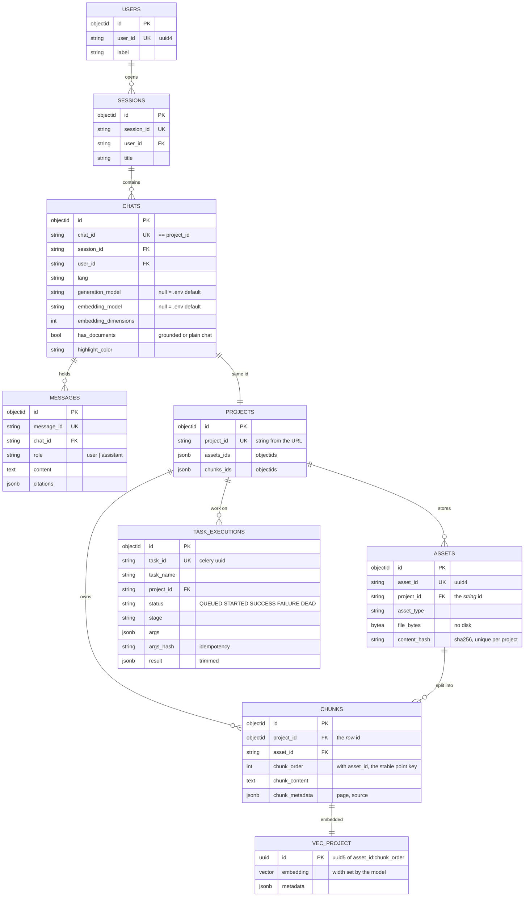

# NotebookLLM⁻

> **NotebookLLM-minus** — NotebookLM, minus the parts that aren't built yet.

Upload documents, ask questions, get answers grounded in *those* documents, with citations
back to the page they came from. A small, deliberately readable RAG backend on **FastAPI**,
with a web UI in English and Arabic.

Every backend is swappable from `.env` — chat model, embedding model, document store, vector
store — and the whole stack runs **offline against a local Ollama** if you want it to. Models
are discovered from what is actually installed and reachable, never pinned in code.

- [Demo](#demo) · [Quickstart](#quickstart) · [Configuration](#configuration) · [Features](#features)
- [Architecture](#architecture) · [Providers](#providers) · [Choosing models](#choosing-models)
- [Database backends](#database-backends) · [Data model](#data-model) · [API](#api)
- [Deployment](#deployment) · [Observability](#observability) · [Project structure](#project-structure)

## Demo

<!-- Video demo goes here. -->

_Coming soon._

## Quickstart

```bash
cd Docker
cp .env.example .env            # database credentials
cp -r env.example env           # per-service env files
docker compose up -d --build    # postgres profile: app, pgvector, nginx, prometheus, grafana
```

Then configure the app itself and run it:

```bash
cd src
cp .env.example .env            # every knob is documented in there
uv sync
uv run uvicorn main:app --reload
```

- UI and API — <http://localhost:8000> (`:8080` through nginx)
- Interactive API docs — <http://localhost:8000/docs>
- Grafana — <http://localhost:3000>, Prometheus — <http://localhost:9090>
- Flower (Celery) — <http://localhost:5555>, RabbitMQ — <http://localhost:15672>

`DOCUMENT_DB_BACKEND` decides which database is used, not which containers are running. The
compose file keeps Mongo and Qdrant behind a profile (`--profile mongo`), so the default
`postgres` setup starts one database instead of two.

## Configuration

`src/.env.example` is the authoritative copy: every setting is documented there, next to the
values it accepts, and every "one of …" list is backed by an enum so a wrong value fails at
startup with the full list rather than on first use. The ones worth knowing about:

| Setting | Does what |
| --- | --- |
| `DOCUMENT_DB_BACKEND` | `mongo` (+ Qdrant) or `postgres` (+ pgvector, one service) |
| `GENERATION_BACKEND` | `anthropic` · `openai` · `google` · `cohere` · `nvidia` · `ollama` |
| `EMBEDDING_BACKEND` | the same minus `anthropic`, which ships no embeddings API |
| `GENERATION_MODEL_ID` / `EMBEDDING_MODEL_ID` | named the way the vendor names them (`gemma4:e4b`, `nvidia/nemotron-3-embed-1b`) |
| `GENERATION_DEFAULT_MAX_TOKENS` | output cap. Sent as `max_tokens` to NVIDIA and `max_completion_tokens` to OpenAI — several NIM schemas reject the newer name outright |
| `EMBEDDING_MODEL_SIZE` | **must match the model** — it is baked into the collection at creation |
| `PDF_LOADER` | `pymupdf` (default) · `pypdf` · `pdfplumber` |
| `OLLAMA_HOST` / `OLLAMA_PORT` | where `ollama serve` is listening |
| `OLLAMA_CLOUD_BASE_URL` | a second Ollama over the network; its models appear alongside the local ones |
| `RETRIEVAL_TOP_K` / `RETRIEVAL_MIN_SCORE` | how many passages reach the prompt, and the floor they must clear |

Only the API key for a backend you actually selected has to be filled in, and it is checked
during startup — a blank key means the app refuses to boot rather than failing on the first
question someone asks. Ollama is exempt: it authenticates by host.

**On `PDF_LOADER`.** Measured on a 274-page Arabic document: `pypdf` 29s and ~90k lost
glyphs, `pdfplumber` 52s and right-to-left text in *visual* order (reversed — not one real
Arabic word survives), `pymupdf` no lost glyphs at all. pymupdf is the default and the only
one that captures the word coordinates a citation highlight is drawn from; it is also much
slower, which `PdfLayoutController` offsets by extracting pages across a process pool.

## Features

**Documents**
- PDF, txt and markdown per notebook; validated on type and size, stored as bytes — nothing touches disk
- Identity is the sha256 of the contents, scoped to one notebook: re-uploading the same file is refused with a 409 before anything is chunked, and renaming does not sneak it past
- Enforced by a partial unique index, so two uploads racing each other collide in the database rather than both landing
- Deleting a source removes it, its chunks and its vectors, derived-first
- Ingestion is idempotent and runs on a worker, so a 200-page PDF never holds an API process

**Chunking**
- `NLTKTextSplitter` on sentence boundaries, with a `RecursiveCharacterTextSplitter` re-splitting anything still over the limit — PDF text often carries no sentence punctuation at all
- Text sanitised at extraction: damaged font encodings decode to NUL bytes, which PostgreSQL refuses in both `text` and `jsonb`
- Unicode normalised to NFKC with bidi controls stripped, so Arabic extracted as presentation forms still matches a normally typed query

**Grounded chat**
- Users → sessions → notebooks → messages, streamed token by token over SSE
- A notebook with documents answers from them with citations; one without is an ordinary assistant — same endpoint, decided by whether vectors exist rather than by a flag
- Citations name the real **page** and open the document there, highlighting the passage in a built-in PDF.js viewer, in a per-notebook colour
- Reasoning models stream their scratchpad into a collapsing panel — shown, never stored
- Generation can be stopped mid-answer, and the partial reply is kept

**Models**
- Six chat and five embedding providers behind factories; nothing above the factory layer names a vendor
- Local and remote Ollama, NVIDIA NIM, Anthropic, Google, OpenAI-compatible endpoints
- The picker probes rather than trusts: capability and entitlement checks cut one vendor catalogue of 82 to the ~12 that actually answer
- Per-notebook model choice; switching the embedding model rebuilds that notebook's index

**Interface**
- Jinja templates plus ES modules, no build step; markdown renders as it streams
- English and Arabic, including right-to-left layout
- Sources / Chat / Studio panels resize by dragging and fold to a rail, remembered across reloads
- Per-notebook temperature, output length, chunk size and overlap
- Answers can be copied, downloaded, or saved back into Sources as a new document

**Operations**
- Two interchangeable database backends behind eight repository interfaces, enforced by a parity test
- Ingestion as a Celery chain, with every run recorded in `task_executions` and swept on a schedule
- Repeat submissions join the run already in flight instead of paying for it twice
- Prometheus metrics at `/metrics`: ingest duration per stage, embedding latency and batch size, time-to-first-token, retrieval latency, whether an answer was grounded — labels bounded to `provider`, `model` and `stage`, never a `chat_id`
- Provisioned Grafana dashboards, Flower for Celery, structured logs with per-request correlation ids
- A health probe that actually calls the database, the embedding model and the vector store rather than reporting what is configured

**Not yet**
- Web-search grounding is stored per notebook and shown marked *soon*, with no backend behind it
- `answer_chat_task` is routed but unimplemented, so no chat worker runs
- Formats past pdf/txt/md are enumerated in `AssetType` and not implemented

## Architecture

Four layers, each talking only to the one below it. Nothing above `factories/` names a
vendor, which is what makes the backends swappable from config.



### Asking a question



`chat_id` **is** the `project_id`, so a notebook is its own document space and reuses the
ingestion path unchanged. Vector point ids are `uuid5(asset_id + chunk_order)` — stable
across re-processing, so re-indexing overwrites in place instead of orphaning vectors.

## Providers

Each subsystem under `src/factories/` is one abstract interface, one implementation per
vendor, and a factory turning a name from `.env` into a configured instance.

| Subsystem | Backends | Interface |
| --- | --- | --- |
| `llmchatting` | `anthropic`, `openai`, `google`, `cohere`, `nvidia`, `ollama` | `generate_text(prompt, chat_history, max_tokens, temperature)` |
| `llmembedding` | `openai`, `google`, `cohere`, `nvidia`, `ollama` | `embed(texts, input_type)` |
| `db` | `mongo` (+ Qdrant), `postgres` (+ pgvector) | eight repository ABCs |

**One neutral message format.** Callers build `{"role", "content"}` dicts using `ChatRole`
and each provider translates on the way out — Anthropic and Google lift the system turn into
a separate argument, Google renames `assistant` to `model`, the rest take it inline.
`generate_text()` is concrete on the interface: it normalises, logs, times and delegates to
`_generate_text()`, so no provider can forget to log and all of them log the same fields.

Normalising includes **forcing strict alternation** — user/assistant/user/… after the system
turn. Ollama accepts any shape; NVIDIA and Anthropic answer `400 Conversation roles must
alternate`. Two ordinary things here produce a shape they reject: a stream that failed or was
abandoned stored a question and never an answer, and history is a window of the last
`CHAT_HISTORY_LIMIT` messages that can open mid-exchange. Consecutive same-role turns are
joined rather than dropped, because an unanswered question is context for the next one.

**Streaming is per provider.** `stream_text()` is concrete on the interface and yields
`{"kind": "thinking" | "content"}` pieces; a provider that cannot stream inherits a fallback
that generates the whole answer and yields it once, so the endpoint works either way and only
latency differs. Ollama and the OpenAI wire format (so OpenAI and NVIDIA) stream for real.
Reasoning arrives on its own field — Ollama's `thinking`, `reasoning_content` on an
OpenAI-compatible server — which is why the scratchpad never has to be parsed back out of the
answer text.

**Embeddings are batch-first**, and two failures are caught at the boundary: a count mismatch
(vectors are zipped against chunk ids by position, so one dropped vector silently misaligns
everything after it) and a width mismatch against `EMBEDDING_MODEL_SIZE`, which would
otherwise surface as an error naming the collection rather than the misconfigured setting.

**`nvidia` is NVIDIA NIM, not a sixth SDK.** Its API *is* OpenAI's, so `NvidiaChatProvider`
is `OpenAIChatProvider` under another name — one line, plus a vendor label so its errors do
not say "OpenAI". It is a separate backend rather than `openai` with a different base URL
because the two are separate accounts with separate catalogues, and a NIM model id carries
its publisher (`meta/llama-3.2-11b-vision-instruct`). `NvidiaEmbeddingProvider` overrides
`_embed` for three real differences: its models are asymmetric (`input_type` is
`passage`/`query`), a request is capped at 256 inputs — under `CHUNKING_BATCH_SIZE`, so the
provider splits the batch itself — and the width is fixed, so `dimensions` is never sent.

No provider class holds a URL, a limit or a wire string. Endpoints and limits are `Settings`
fields; vendor spellings (`passage`, `END`) are tables in `enums/ProviderMappings.py`; and
which settings reach which constructor is one more table walked by `setting_kwargs()`.
Giving a provider a new knob is a line in that table plus a field on `Settings` — the
factories never branch per vendor.

## Choosing models

A notebook can name its own chat and embedding model, and the picker is built from what is
genuinely available rather than a hardcoded list. `ModelController` merges every configured
source and groups the result twice.

**By source** — `local` and `cloud` are two Ollama hosts, `nvidia` is a hosted vendor. A
model id carries its source (`local/gemma4:e4b`, `nvidia/meta/llama-3.2-11b-vision-instruct`)
and that prefix selects the *provider*, so one notebook can run on a local model while the
next runs on NVIDIA — something a single global `GENERATION_BACKEND` cannot express.

**By parameter size** — under 8B, 8B–30B, over 30B, sorted smallest first. Ollama reports the
count; NVIDIA does not, so it is read out of the tag, where nearly every model carries one. A
mixture-of-experts tag names its total before its active count (`120b-a12b` is a 120B model),
a version is not mistaken for a size, and a tag advertising nothing is filed under "size
unknown" rather than guessed at.

**Chat and embedding lists are disjoint by capability.** Ollama embeds with *any* model —
`llama3.1:8b` answers an embed probe with 4096 dimensions — so answering was never evidence
of belonging in the embedding list. `/api/show` reports real capabilities where `/api/tags`
does not, and `completion` / `embedding` decide. A model reporting neither is offered for
chat, the one thing every model can do.

**NVIDIA models are filtered to the ones that actually answer**, in two passes, because
entitlement and usability are different questions and only the first is free.

`/v1/models` lists NVIDIA's whole catalogue, but an account may call a fraction of it and the
rest answer `404 Function …: Not found for account` only once chosen. Entitlement is checked
before body validation, so posting an empty `messages` list separates them at no cost — 400
means reachable, 404 means not yours, neither runs inference.

Passing that says nothing about whether a model accepts the request this application sends.
Of the twenty that reach the second pass, several reject the output-cap field outright
(`extra_forbidden`), some are not chat models and answer 500, and some never answer at all.
So the survivors are asked for one token using the same field names the provider sends —
read from the provider class, so the probe cannot test a shape the provider no longer uses.

A **timeout is not cached** as a refusal: a large model can miss the deadline waking up and
answer comfortably once warm, and a remembered no would hide it until a restart. Definite
verdicts are cached on the class, so the first catalogue call after a restart pays for the
probing and later ones are a dict lookup.

What survives is what responds — not what is useful. A safety classifier answers
`{"User Safety": "safe"}` to anything, and that is a working endpoint by every mechanical
test; excluding it would mean judging a model by its name.

## Database backends

`DOCUMENT_DB_BACKEND` picks the store behind users, sessions, notebooks, messages, projects,
assets and chunks. Both implement the same repository interfaces, so nothing above `app.db`
knows which is running.

| | `mongo` | `postgres` |
| --- | --- | --- |
| Documents | MongoDB via `motor` | PostgreSQL via SQLAlchemy 2.0 + `asyncpg` |
| Vectors | Qdrant, a second service | pgvector, in the same database |
| Schema | implicit; indexes ensured at startup | explicit; owned by Alembic |
| Services | two | one |

They are not interchangeable at runtime — each keeps its own data, and switching the setting
points the app at a different store rather than migrating anything. The Postgres DSN is
assembled from `POSTGRES_HOST/PORT/USER/PASSWORD/DB`, credentials percent-encoded, so there
is no `DATABASE_URL` to keep in sync and no password in a committed file.

### Migrations

Tables are declared once as SQLAlchemy models in `factories/db/postgres/base_repository.py`.
Alembic reads that metadata and every repository queries the same classes, so a column that
does not exist is an `AttributeError` at import rather than a 503 on first request.

Nothing needs running by hand: `alembic upgrade head` runs during the app's lifespan under a
Postgres advisory lock, so several workers booting at once cannot race. To drive it yourself,
from `src/` (the config lives beside the backend it migrates, hence `-c`):

```bash
uv run alembic -c factories/db/postgres/alembic.ini upgrade head
uv run alembic -c factories/db/postgres/alembic.ini revision --autogenerate --rev-id 0008 -m "…"
```

Revision ids are numbered by hand so `ls versions/` reads in order. **An autogenerate run
against a database already at head must produce an empty migration** — that is the check this
arrangement exists to make possible; if it is not empty, the models and the database have
drifted.

`0001` creates everything with `IF NOT EXISTS` so a database predating Alembic is adopted in
place. What that cannot do is reconcile a table that exists with the *wrong shape* — it skips
the whole table, columns and all — which is what `0002` exists for, after every read of a
user's sessions failed with `UndefinedColumnError`. Anything column-level needs its own
migration. Seven so far: initial schema, sessions reconcile, asset content hash, chunk lookup
index, notebook highlight colour, task executions, unique asset content.

`0007` finally enforces one copy of a document per notebook — the index the dedupe lookup has
claimed to use since `0003`, deferred three times because the databases held duplicates and
choosing which copy to keep is not a migration's decision. It deduplicates nothing: it checks,
and stops with a message naming the offending rows if any remain.

**pgvector collections are not Alembic's.** One table per notebook, `vec_<collection>`,
created at runtime — the vector width is not known until an embedding model is chosen, and a
shared table would mean one fixed width for everyone. Alembic creates the extension; the
repository creates the tables. `env.py`'s `include_name` hook excludes them from the
autogenerate diff, without which every run proposed dropping every vector in the database.

## Data model



Two things in that diagram are worth internalising early, because both have caused real
bugs. `Project.project_id` is the **string** from the URL while `DataChunk.project_id` is the
project's **`_id`** — the same field name meaning two different things one table apart. And
`VEC_PROJECT` is not one table: it is one per notebook, `vec_<collection>`, created at runtime
because the vector width is not known until an embedding model is chosen.


| Collection | Key fields |
| --- | --- |
| `projects` | `project_id` (string, from the URL), `assets_ids`, `chunks_ids` |
| `assets` | `asset_id` (uuid4), `asset_type`, `project_id`, `file_bytes`, `content_hash` |
| `data_chunks` | `project_id` (**ObjectId**), `asset_id`, `chunk_order`, `chunk_content` |
| `task_executions` | `task_id` (Celery uuid), `task_name`, `project_id`, `status`, `stage`, `args_hash` |

The same pydantic documents back both stores; on Postgres they are tables of the same names
(`data_chunks` becomes `chunks`). The identifier distinction is worth internalising early:
`Project.project_id` is the string from the URL, while `DataChunk.project_id` is the
project's `_id`. Primary keys stay 24-hex `ObjectId` strings on Postgres too, because the
models are shared with the Mongo backend.

`task_executions` is the one table that is not part of that tree — it records work rather
than content, and is keyed by the Celery task id. Its `result` is stored trimmed: processing
returns the full text of every chunk it created, and keeping that would copy each ingested
document into the table a second time, so the counts are kept and the bodies dropped.

Users → sessions → notebooks → messages, with assets and chunks hanging off a notebook.
Nothing cascades in either store, so deletion routes walk the tree themselves, derived-first
at every level — a partial failure leaves a source visibly listed rather than leaving vectors
that outlived it.

## API

Full interactive reference at `/docs`. The shape of it:

| Method | Path | |
| --- | --- | --- |
| `GET` | `/base/health` | app name and version |
| `GET` | `/nlp/health` | live probe — database, embedding model, vector store |
| `POST` | `/data/upload/{project_id}` | store a file as an asset |
| `POST` | `/process/{project_id}` | queue chunking for one asset, or every asset in the project |
| `GET` | `/process/tasks/{task_id}` | read queued processing state and result |
| `POST` | `/nlp/index/push/{project_id}` | embed a project's chunks and upsert them |
| `POST` | `/nlp/index/search/{project_id}` | ranked passages with citation metadata |
| `GET` | `/nlp/index/info/{project_id}` | collection name, size, width |
| `GET/POST/PATCH/DELETE` | `/chat/users…`, `/chat/users/{id}/sessions`, `/chat/sessions/{id}/chats` | profiles, sessions, notebooks |
| `POST` | `/chat/chats/{chat_id}/message` | ask a question — streams SSE |
| `GET` | `/chat/chats/{chat_id}/messages` | transcript |
| `POST/GET/PATCH/DELETE` | `/chat/chats/{chat_id}/assets…` | a notebook's documents, content, rename, delete |
| `GET` | `/chat/chats/{chat_id}/assets/{asset_id}/chunks/{n}/locate` | where a citation sits on the page |
| `GET` | `/chat/chats/{chat_id}/indexing` | ingest progress, mid-upload |
| `GET` | `/chat/models` | the catalogue the picker is built from |
| `PATCH` | `/chat/chats/{chat_id}/models` | point a notebook at different models |
| `PATCH` | `/chat/chats/{chat_id}/settings` | temperature, output length, chunking, colour |

Asking a question streams newline-delimited JSON events — `meta` first (grounded flag and
citations, so sources paint before the first token), then `thinking` and `delta` pieces, then
`done`:

```bash
curl -N -X POST localhost:8000/chat/chats/$CHAT/message \
     -H 'content-type: application/json' -d '{"text": "what does it say about X?"}'
```

Switching a notebook's embedding model **rebuilds its index** — vector width is fixed when a
collection is created, so old vectors are unusable. The chunks are already stored, so the
rebuild re-embeds them rather than asking for the documents again.

### Background processing

Ingestion runs in Celery rather than inside the FastAPI request. Attaching a document stores
the file and returns `202 Accepted` immediately with an `asset_id` and a `task_id`; chunking
and embedding then happen on the workers.

**Processing and indexing are one chain.** `chain(process → index)` is queued as a unit, so a
document can never be left chunked-but-unindexed — the state where a notebook looks grounded
and retrieves nothing. The signatures are immutable (`.si`) on purpose: a mutable one would
bind the first task's result dict to the second's `project_id`, and `reset` means "delete this
asset's chunks" upstream but "drop the whole vector collection" downstream.

**Every run is recorded.** `task_executions` holds one row per task — name, arguments, status,
stage, progress, trimmed result, timings — so history survives the Redis result TTL, can be
joined to the project it acted on, and is what the browser's progress bar polls. Celery's own
state cannot do any of that, and cannot report a task whose worker was killed: that row would
say `STARTED` forever, because the process that would have written the ending is gone.

Statuses are `QUEUED`, `STARTED`, `SUCCESS`, `FAILURE` and `DEAD`. The last has no Celery
equivalent and is the point of the table — work cancelled because the chain ahead of it
failed, or abandoned when its worker vanished.

**Repeat submissions join the run in progress.** `IdempotencyController` fingerprints
`(task_name, args)` and returns `200` with the existing `task_id` instead of `202`, so a
double-click does not pay for the same embedding twice. It is a query rather than a unique
constraint by choice: both tasks are already re-runnable — processing skips assets that are
already chunked, indexing upserts on a deterministic point id — so a constraint would turn a
harmless race into a `500` rather than preventing anything that matters.

The workloads are isolated into `process`, `index` and `maintenance` queues. Session CRUD,
listings, health checks and semantic reads remain in FastAPI because they are short
transactional or streaming operations and do not benefit from an extra broker round trip.

The API and workers must share the same broker and result backend. From `src/`:

```bash
uv run celery -A celery_app.celery_app worker -Q "$CELERY_PROJECT_NAME.process_data_task" --loglevel=INFO --concurrency=2
uv run celery -A celery_app.celery_app worker -Q "$CELERY_PROJECT_NAME.index_project_task" --loglevel=INFO --concurrency=1
uv run celery -A celery_app.celery_app worker -Q "$CELERY_PROJECT_NAME.maintenance_task" --loglevel=INFO --concurrency=1
uv run celery -A celery_app.celery_app beat --loglevel=INFO
```

Compose runs the same set as `celery-process`, `celery-index`, `celery-maintenance` and
`celery-beat`. There is no `celery-chat`: `answer_chat_task` is named in the queue enum and
routed to, but no such task exists, and a worker for it would consume a queue nothing can
publish to while appearing in Flower as capacity that is not there.

**The sweep.** `maintenance_task` runs every `CELERY_MAINTENANCE_INTERVAL_HOURS` (default 24)
and does two things: marks work that can no longer be running as `DEAD`, and deletes finished
rows older than `CELERY_TASK_RETENTION_DAYS` (default 7). Two cutoffs, because the two failures
differ. A run that started longer ago than twice the hard time limit is definitionally not
running. Queued work gets the full retention window instead — a task waits legitimately for as
long as its workers are down, and a tight cutoff would report a deploy as data loss.

Broker and result-backend connection failures are the `CeleryError` branch of the exception
hierarchy and return `503`. A task's own failure stays in its row and its result, with the
exception type alongside the message.

### Code quality

Black and Ruff are configured in `src/pyproject.toml`. The repository's native pre-commit hook
runs them automatically for staged Python files. Activate it once per checkout:

```bash
git config core.hooksPath .githooks
```

To run the same checks manually from the repository root:

```bash
black --config src/pyproject.toml src
ruff check --config src/pyproject.toml src
```

## Deployment

`.github/workflows/deploy-main.yml` runs the suite on every push to `main` and, only if it is
green, ssh's to the host, fast-forwards the checkout and restarts the systemd unit. Secrets:
`SSH_MAIN_HOST_IP`, `SSH_MAIN_PRIVATE_KEY`. The remote user needs passwordless sudo for
exactly one command:

```
omar ALL=(root) NOPASSWD: /usr/bin/systemctl restart notebookllm-minus
```

sudoers matches a command as written, so the path and arguments must match the invocation
character for character — `sudo -n -l` over ssh lists what is actually permitted.

The unit itself is `Type=oneshot` with `RemainAfterExit=yes`, running `docker compose up -d
--build` in the checkout. The restart *is* the deployment only because the checkout moved
first; that is why the workflow pulls before restarting.

## Observability

Prometheus scrapes five targets, all addressed by compose service name so nothing depends on
a published port:

| Job | Source |
| --- | --- |
| `notebookllm` | the app's own `/metrics` |
| `postgres` | `postgres-exporter` |
| `rabbitmq` | `rabbitmq_prometheus`, on `/metrics/per-object` |
| `prometheus` | itself |
| `node` | `node_exporter` **on the host**, not in the stack |

The RabbitMQ job needs `/metrics/per-object` specifically. The default `/metrics` aggregates
everything into one series per metric with no `queue` label, which is why the queue panels
rendered empty: `rabbitmq_queue_messages_ready` came back as a single `{instance, job}` series
and the dashboard's `$queue` variable had nothing to resolve. Per-object is per *queue*, and
Celery creates far more queues than this application defines — 28 `celery_delayed_N` for
native delayed delivery, plus a `celeryev.<uuid>` and a `celery@<host>.celery.pidbox` per
worker, all churning on every restart — so a `metric_relabel_configs` drop keeps the stored
series to the queues that mean something.

**Flower** runs on `:5555` for Celery itself: live workers, task history, per-task metrics at
its own `/metrics`. It is built from the application image rather than `mher/flower` so
`--app celery_app:celery_app` reads the same broker and backend URLs the workers do, instead
of a second copy of the DSN in compose that could drift. Task history needs events, enabled
once in `celery_app.py` (`worker_send_task_events`, `task_send_sent_event`) rather than as
`-E` on four worker commands that could fall out of step.

Note that `FLOWER_BASIC_AUTH=""` does **not** mean "no authentication" — Flower reads an empty
string as "auth is on, with no valid users" and answers `401` to every route except
`/healthcheck`, so the container passes its health probe while the dashboard is unreachable.
`env/.env.app` keeps the variable commented out instead.

`node_exporter` is the one piece to install separately (`apt install
prometheus-node-exporter`). Both the app and Prometheus map `host.docker.internal` to
`host-gateway`, because that name is a Docker Desktop convenience that does not exist on
Linux — without it the node job sits down with a DNS error while every other target is green.

`/nlp/health` is deliberately **not** scraped: it performs a real embedding inference, so a
15s scrape would fire one four times a minute forever. Liveness comes from the app's job
being up at all.

Grafana provisions its dashboards by scanning `Docker/grafana/dashboards/`, so a new `*.json`
there is picked up without being listed anywhere: FastAPI observability, PostgreSQL, host, and
RabbitMQ broker/queue health.

## Error handling

Domain errors live in `exceptions.py`, each carrying the status it maps to —
`NotFoundError` 404, `InvalidInputError` 400, `DbError` 503, `LLMProviderError` 502. Routes
raise them and one handler in `main.py` turns them into responses, so no route builds an
error body by hand and no failure is logged twice. Anything unrecognised becomes a 500 with
the traceback in the log and nothing revealing in the response.

## Logging

stdlib `logging`, configured once in `utils/logging_config.py`: rotating file output under
`LOG_DIR`, optional console, and `text` or `json` format. Every request gets a correlation id
attached by `middleware/request_logging.py` and carried on every line it produces. Log lines
carry counts and sizes — never prompt text, answer text or document content, which is exactly
what should not be sitting in a log file.

## Project structure

```
src/
├── main.py                 # app, lifespan, providers, error handler
├── routes/                 # HTTP only — base, data, process, nlp, ui
│   ├── chat/               # users · sessions · chats · messages · assets · models
│   └── schemas/            # request models
├── controllers/            # the work: chat, process, text processing, nlp, models, pdf layout
├── task/                   # Celery adapters and background-processing services
│   ├── process.py           # task submission, execution lifecycle, result lookup
│   └── process_service.py   # asset validation, chunking and persistence workflow
├── factories/              # swappable backends
│   ├── llmchatting/        # interface + 6 providers + factory
│   ├── llmembedding/       # interface + 5 providers + factory
│   ├── db/                 # mongo/ and postgres/ behind 8 repository ABCs, + alembic/
│   └── setting_kwargs.py   # {kwarg: settings field} tables -> constructor kwargs
├── models/                 # pydantic documents + the model classes that read them
├── templates/locales/      # prompts sent TO the model, per language
├── web/                    # templates/ and static/ sent TO the browser
├── enums/                  # every .env choice, plus ProviderMappings' lookup tables
└── utils/                  # Settings, logging, metrics, model id vocabulary
Docker/                     # compose, nginx, prometheus, grafana dashboards
test/                       # unit + route tests, fakes for every backend
```

**Two directories are called templates on purpose.** `templates/` holds prompts sent to the
model; `web/templates/` holds Jinja HTML sent to the browser. Different audiences, so they
never share a file.
